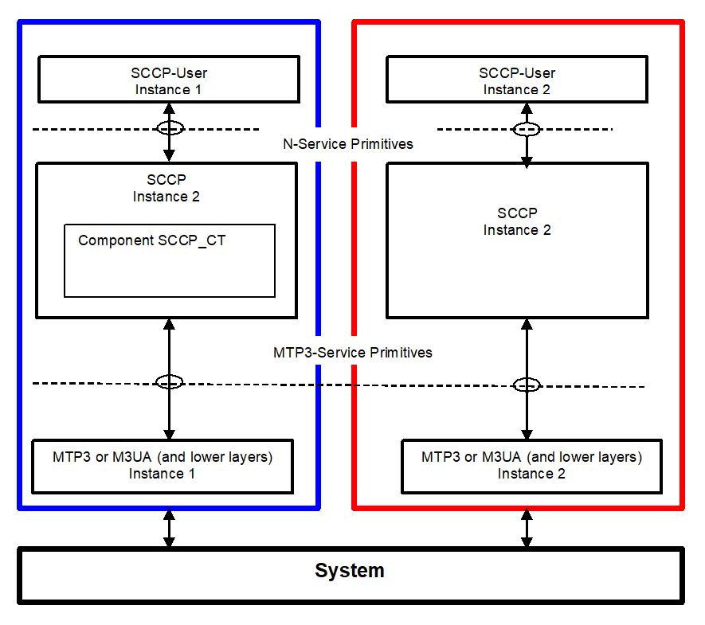
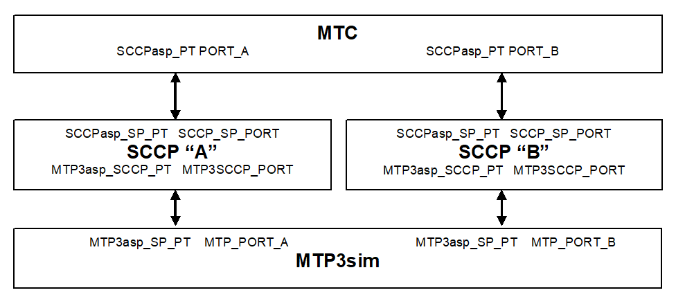
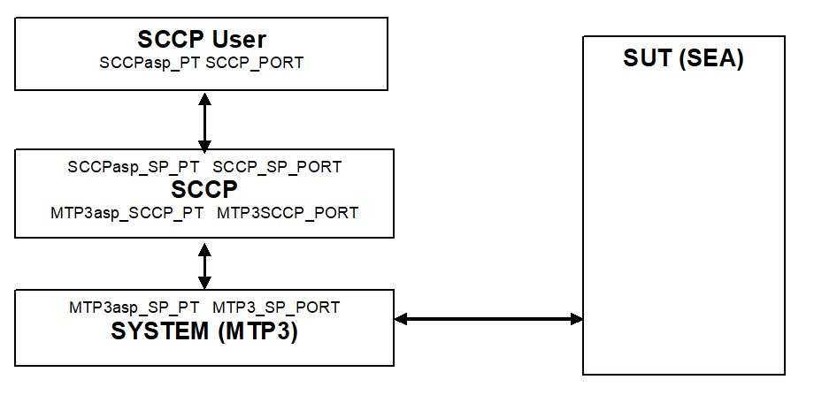

= SCCP Protocol Emulation for TTCN-3 Toolset with TITAN, Description
:author: János Kövesdi
:toc: left

== Functionality

"The Signaling Connection Control Part (SCCP) provides additional functions to the Message Transfer Part (MTP) to cater for both connectionless as well as connection-oriented services to transfer … signaling information" <<_6, [6]>>.

The SCCP protocol emulation (PE) implements the SCCP protocol specified by `ITU-T` (see <<_6, [6]>>-<<_9, [9]>>), ANSI (<<_10, [10]>>), `MPT` and `TTC` (<<_11, [11]>>-<<_14, [14]>>). The emulation is performed in language TTCN-3 <<_1, [1]>> and it supposes the TTCN-3 Test Tool with TITAN test executor <<_2, [2]>> as environment.

The SCCP PE is developed for testing implementations of SCCP Users using TTCN and it uses the services of underlying level `MTP3` (see in figure below). It is considered that the SCCP layer of the peer conforms to the same specifications as SCCP PE does.

See service primitives in SS7 below:

[[functionality_SS7_service_primitives]]
image::images/functionality_SS7_service_primitives.png[alt]

The SCCP (and therefore SCCP PE itself) is situated between the `MTP3` and the SCCP-User. SCCP communicates with them via service primitives.

=== Implemented Protocols

The SCCP protocol uses the `MTP` for basic routing and error detection.

Signaling System 7 network:

* Network layer:
** MTP Level 3 (M3UA – RFC 3332)
** SCCP (Q.711 (03/01)
* Data link
** MTP Level 2
* Physical layer
** MTP Level 1

The `ITU-T` recommendations for the Message Transfer Part are:

* Functional description of the message transfer part (MTP) of Signaling System No. 7 - Q.701 (03/93)
* Signaling data link - Q.702 (11/88)
* Signaling link - Q.703 (07/96)
* Signaling network functions and messages - Q.704 (07/96)
* Signaling network structure - Q.705 (03/93)

The SCCP application can operate directly over the SCCP User Adaption protocol (SUA).

=== Supported Standards

SCCP PE implements SCCP specification of `ITU`, `ANSI`, `MPT` and `TTC` in one module.

Several component instances of the SCCP PE behavior can be used in a TTCN-3 test configuration. Each of the test component instances can behave according to one of the above versions of SCCP (`ITU` or `ANSI` or `MPT` or `TTC`).

=== Modified and Non-Implemented Protocol Elements

For detailed information see section <<feature-list,Feature List>>. In section <<capacity_and_limitation, Capacity and Limitation>>, you can find a summary of capacity and limitations (including the not implemented parts).

==== Missing Primitives

The following primitives are not implemented: `LUDT`, `LUDTS, MTP3-PAUSE`,`MTP3-RESUME` and `MTP3-STATUS` (sections <<capacity_and_limitation, Capacity and Limitation>> and <<differences_between_ITU_ANSI_MPT_and_TC,  Differences between ITU, ANSI, MPT and TTC>>).

==== Routing Functionality and Global Title Translation Omitted

Routing functionality is not implemented: SCCP PE emulates a signaling endpoint. Accordingly, Global Title Translation is not implemented either. (Sections <<global_title_translation, Global Title Translation>> and <<capacity_and_limitation, Capacity and Limitation>>)

==== Management Messages Are Only Partially Implemented

The following management messages are not implemented:

`SOG`: Subsystem-out-of-service-grant (1.16/Q.712)

`SOR`: Subsystem-out-of-service-request (1.17/Q.712)

For further details see section <<SCCP_management_functionality, SCCP Management Functionality>>.

==== Flow Control Not Supported

Not implemented by SCCP PE as Service Class 3 is not supported.

=== Ericsson-Specific Changes

Change Request `MTTSM00016068` was implemented to support `MPT` (China) version.

=== Backward Incompatibilities

None.

=== System Requirements

In order to operate the SCCP PE the following system requirements must be satisfied:

* TITAN TTCN-3 Test Executor version R7B (1.7.pl1) or higher installed. For installation guide see <<_2, [2]>>.

NOTE: This version of the protocol module is not compatible with TITAN releases earlier than R7B.

[[feature-list]]
== Feature List

=== Service Classes

Service primitives are implemented as messages in the test ports.

There are four service classes in SCCP (see 6/Q.711 and 2/T1.112.1-2001) as follows:

* 0 - Basic connectionless class

* 1 - In-sequence delivery connectionless class

* 2 - Basic connection-oriented class

* 3 - Flow control connection-oriented class.

The SCCP PE supports classes 0,1,2 but does not support class 3.

There is no difference between class 0 and 1 because only one test port used by `MTP`.

=== MTP3 Service Primitives

`MTP3` Abstract Service Primitives are received and sent by SCCP across service access points (see <<functionality_SS7_service_primitives, figure>>) and can be found in the <<MTP3_primitives_handled_by_SCCP_PE, table>> below.

"Not implemented" primitives are discarded by SCCP PE.

[[MTP3_primitives_handled_by_SCCP_PE]]
[cols=",,,",options="header",]
|==============================================
3+^.^|*ITU-T, ANSI, and TTC names* |*Implementation info*
|*Generic name* |*Specific name*|*Parameters*|*ASP Name*
|`MTP-TRANSFER` |Request or indication |OPC, DPC, SLS, SIO,
User data |ASP_MTP3_TRANSFERreq,
ASP_MTP3_TRANSFERind
|`MTP-PAUSE` |Indication |Affected DPC |Not implemented
|`MTP-RESUME` |Indication |Affected DPC |Not implemented
|`MTP-STATUS` |Indication |Affected DPC Cause |Not implemented
|==============================================

The fields are the same for ITU, ANSI, MPT and TTC but their lengths are different as follows:

See the Size of fields in different specifications below:

[[size_of_fields_in_different_specifications]]
[cols=",,,,",options="header",]
|==================
| 4+^.^|*Length in bits* |
*Field* |*ITU-T* |*ANSI* |*MPT national*** |*TTC national** |
SIO |8 |8 |8 |8 |
DPC |14 |24 |24 |16 |
OPC |14 |24 |24 |16 |
SLS |4 |8 |4 |4 |
|==================

*:If SIO sub-service field=0`. Otherwise TTC international is the same as ITU-T

**:MPT international is the same as ITU-T

=== SCCP Messages

User data fields of MTP3 primitives received by SCCP from MTP3 (or from M3UA) are mapped to N-service primitives that will be sent to the SCCP User(s).

The User data field of an MTP3 signal unit contains the SCCP message as an octetstream (i.e. an octetstring) in order LSB (lowest bit sent/received first).

The structure and fields of an SCCP message are coded and decoded according to ITU Q.713 <<_8, [8]>>, ANSI T1.112-2001 <<_10, [10]>> or TTC JT-Q713 <<_13, [13]>>.

The first octet of the SCCP message is the message type. Its value determines the decoding of the octetstring further handling. An SCCP message received may be mapped to an N-service primitive or may invoke an exception handling procedure based on the state of the SCCP PE. The supported message types and the related mappings are summarized in table below.

(Compare it with Table 1/Q.713, Table1/T1.112.3 and Table1/JT-Q713.)

See Message types implemented by SCCP PE in the table below:

[[message_types_implemented_by_SCCP_PE]]
[width="100%",cols="15%,5%,5%,5%,15%,30%,25%",options="header",]
|=============================================================================================================================
.1+^.^|*Message type (in MTP-TRANSFER req)* 3+^.^|*Protocol Classes* |*Message type code* |*Handling (depending on SCCP state)* |*Remark*
| |*0* |*1* |*2* | | | |
CR Connection request | | |X |0000 0001 |N-CONNECT ind |Not supported by TTC |
CCConnection confirm | | |X |0000 0010 |N-CONNECT conf / or Back: ERR / |Not supported by TTC |
CREF Connection refused | | |X |0000 0011 |N-DISCONNECT (see Q.713.A.1) |Not supported by TTC |
RLSD Released | | |X |0000 0100 |Active=>N-DISCONNECT indication Idle OR wait for CC=>Back RLC
Otherwise=>discard, log only see Q.714/B.2 |Not supported by TTC |
RLC Release complete | | |X |0000 0101 |N-DISCONNECT ind |Not supported by TTC |
DT1Data form1 | | |X |0000 0110 |Active=>N-DATA ind OR
Conn pending OG=>N-DISCONNECT |Not supported by TTC |
UDTUnitdata |X |X | |0000 1001 |N-UNITDATA indication OR UDT with SSA | |
UDTSUnitdata Service |X |X | |0000 1010 |N-UNITDATA indication | |
ERRProtocol data unit error | | |X |0000 1111 |Idle=>ERR OR Active=>N-DISCONNECT ind |Not supported by TTC |
IT Inactivity Test | | |X |0001 0000 | |Not supported by TTC |
XUDTExtended Unitdata |X |X | |0001 0001 |N-UNITDATA indication | |
XUDTSExtended Unitdata Service |X |X | |00010010 |N-UNITDATA indication | |
|=============================================================================================================================

This table describes what kind of messages SCCP PE accepts from MTP3 and how they are translated. The translation rule is more complicated than it is described in <<message_types_implemented_by_SCCP_PE, table>> above. Details can be found in Q.714.

=== SCCP Primitives of the Connectionless Service

SCCP can provide 2 classes of connectionless services (0 and 1) but there is no difference between them in this implementation (see 6/Q.711 and 2/T1.112.1-2001).

The primitives to the upper layers and the corresponding parameters for connectionless service are implemented as follows:

See Primitives and their Mappings for Connectionless Service below:

[cols=",,,,",options="header",]
|==============================================
3+^.^|*ITU-T, ANSI, and TTC names* 2+^.^|*Protocol implementation info*
|*Generic name* |*Specific name*|*Parameters*|*ASP Name* |*Msg type mapped to OR next msg to be sent back* |
`N-UNITDATA` |Request or indication |Called Address
Calling Address
Sequence Control
Return Option
Importance
User data |N_UNITDATA_req
N_UNITDATA_ind |Req=>UDT
From UDT=> Ind |
`N-NOTICE` |Indication |Called Address
Calling Address
Reason for return
User Data
Importance |N_NOTICE_ind |From UDTS
|==============================================

=== SCCP Primitives for Connection-Oriented Services

[cols=",,,,",options="header"]
|===
3+^.^|*ITU-T, ANSI, and TTC* 2+^.^|*Protocol implementation info*
|*Generic name* |*Specific name*|*Parameters*|*ASP Name* |*Msg type mapped to*
.2+|`N-CONNECT` |Request indication .2+|Called Address
Calling Address +
Responding Address +
Expedited selection +
Quality of services parameter set +
User data +
Importance +
Connection identification |N_CONNECT_req
N_CONNECT_ind |Connection request (CR)
|Response Confirm |N-CONNECT_res |Connection confirm (CC)
|`N-DATA` | Request indication |Importance
User data
Connection identification | |Data form 1 (DT1)
|`N-DISCONNECT` |Request Indication |
Originator +
Reason +
User data +
Responding address +
Importance +
Connection identification | |Released (RLSD) OR Connection refusal (CREF) see Q.714/3.3
|===

[[SCCP_management_functionality]]
=== SCCP Management Functionality

There is no interworking between MTP3/M3UA and SCCP management.

SCCP management messages (see 1.15-1.19/Q.712/):

`SSA`:: Subsystem-allowed (1.15/ Q.712)

`SOG`:: Subsystem-out-of-service-grant (1.16/Q.712)

`SOR`:: Subsystem-out-of-service-request (1.17/Q.712)

`SSP`:: Subsystem-prohibited (1.18/Q.712)

`SST`:: Subsystem-status-test (Q.712/1.19)

These messages are not supported by TTC.

The SCCP management is restricted to the following:

[[management_message_handling]]
[cols=",",options="header",]
|======================
|*Received* |*Returned*
|`SST` |`SSA`
|`SSP` |`SST`
|`SSA` |`SSA`
|======================

=== Inactivity Control

It is implemented.

=== Message Sequence Control

SCCP PE maintains the order of messages between of upper and lower layer interfaces.

=== Segmentation and Reassembly

It is a feature in service class 0 and 1. SCCP PE supports it.

=== State Machine

SCCP PE maintains a state machine behavior for each connection-oriented services according to Figure 8/Q.711.

[[global_title_translation]]
=== Global Title Translation

Not supported.

[[capacity_and_limitation]]
=== Capacity and Limitation

See features with restriction in SCCP PE in the following table:

[width="100%",cols="34%,33%,33%",options="header",]
|==========================================================================================================================================
|*Feature* |*Restriction* |*Remark*
|Handling different length of signaling point codes thus addresses |ITU ANSI and TCC are implemented. |Specification dependent, see <<size_of_fields_in_different_specifications, table>> above.
|Management |Partially implemented (see <<management_message_handling, table>> above) |Not supported by TCC
|Service class 1 |Supported |
|Service class 2 |Supported |Not supported by TTC
|Service class 3 |NOT IMPLEMENTED |Not supported by TTC
|Routing |NOT IMPLEMENTED |SCCP PE is a signaling endpoint
|Message sequence control |NOT IMPLEMENTED |Indifferent
|Flow control |NOT IMPLEMENTED |Because class 3 not supported
|Reassembly |NOT IMPLEMENTED |
|LUDT, LUDTS transfer |NOT IMPLEMENTED |Because ATM carrier not considered
|Global title translation |NOT IMPLEMENTED |
|MTP3-PAUSE, MTP3-RESUME, MTP3-STATUS sending and processing after receiving |NOT IMPLEMENTED |
|==========================================================================================================================================

There shall be exactly one SCCP User test component instance for each SCCP PE instance. An SCCP PE instance is able to handle up to 16 SCCP connections and 16 segmented `N-UNITDATA` messages at the same time.

[[differences_between_ITU_ANSI_MPT_and_TC]]
=== Differences Between ITU, ANSI, MPT and TTC

1.  Address length (see <<size_of_fields_in_different_specifications, table>> above).
2.  TTC doesn’t support connection-oriented services and management functionality.
3.  TTC doesn’t support management functionality.
4.  ANSI has different Address Indicator structure (Order of PC and SSN is changed, see Figure 4/Q.713 (07/96) and Figure 4/T1.112.3)
5.  ANSI has different Address Elements structure (Ordering of PC and SSN is changed, see Figure 5/Q.713 (07/96) and Figure 4A/T1.112.3)
6.  ANSI has different gti0001 structure (see Figure 7/Q.713 (07/96) and Figure 6/T1.112.3)
7.  ANSI doesn’t support gti0011 and gti0100. More exactly ANSI gti0001 = ITU gti0011
8.  ANSI doesn’t support optional field ``importance''.
9.  TTC doesn’t support LUDT, LUDTS

== Test Port Usage

The SCCP PE is developed for testing implementations of SCCP Users using TTCN-3 and it uses the services of underlying level MTP3. It is considered that the SCCP layer of the peer conforms to the same specifications as SCCP PE does.

See service primitives in SS7 below:

=== The User Interface: the N-Service Primitives

SCCP PE communicates with its user by means of N-Service primitives.

These primitives are implemented as TTCN-3 records. Any SCCP User inserts its message in the field `User Data`. Their implementation can be found in file __SCCPasp_Types.ttcn__.

==== SCCP Primitives of Connectionless Service

SCCP PE can receive `N_UNITDATA_req` messages and can send `N_UNITDATA_ind` and `N_NOTICE_ind` in case of connectionless communication. Their implementation is the following (for details see the file __SCCPasp_Types.ttcn__ itself):

[source]
----
type record N_UNITDATA_req
{
  SCCP_PAR_Address          calledAddress               ,
  SCCP_PAR_Address          callingAddress              ,
  SCCP_PAR_Sequence_Control sequenceControl    optional ,
  SCCP_PAR_Return_Option    returnOption       optional ,
  SCCP_PAR_UserData         userData                    ,
  SCCP_PAR_Importance       importance         optional
 }

type record N_UNITDATA_ind
{
  SCCP_PAR_Address           calledAddress              ,
  SCCP_PAR_Address           callingAddress             ,
  SCCP_PAR_Sequence_Control  sequenceControl  optional  ,
  SCCP_PAR_Return_Option     returnOption     optional  ,
  SCCP_PAR_UserData          userData                   ,
  SCCP_PAR_Importance        importance       optional
}

type record N_NOTICE_ind
{
  SCCP_PAR_Address           calledAddress            ,
  SCCP_PAR_Address           callingAddress           ,
  SCCP_PAR_Reason_For_Return reasonForReturn          ,
  SCCP_PAR_UserData          userData                 ,
  SCCP_PAR_Importance        importance       optional
}
----

==== SCCP Primitives of Connection Oriented Service

SCCP PE can receive `N_CONNECT_req`, `N_CONNECT_res`, `N_DATA_req` and `N_DISCONNECT_req` and send them as `N_CONNECT_ind`, `N_CONNECT_cfm`,`N_DATA_ind` and `N_DISCONNECT_ind`, respectively.

Their implementation is the following:

[source]
----
type record N_CONNECT_req
{
   SCCP_PAR_Address            calledAddress,
   SCCP_PAR_Address            callingAddress     optional,
   SCCP_PAR_Expedited_Data_Sel expeditedDataSel   optional,
   SCCP_PAR_Quality_Of_Service qualityOfService   optional,
   SCCP_PAR_UserData           userData           optional,
   SCCP_PAR_Connection_Id      connectionId       optional,
   SCCP_PAR_Importance         importance         optional
}

type record N_CONNECT_ind
{
   SCCP_PAR_Address            calledAddress,
   SCCP_PAR_Address            callingAddress     optional,
   SCCP_PAR_Quality_Of_Service qualityOfService   optional,
   SCCP_PAR_UserData           userData           optional,
   SCCP_PAR_Connection_Id      connectionId       optional,
   SCCP_PAR_Importance         importance         optional
}

type record N_CONNECT_res
{
   SCCP_PAR_Address            respondingAddress optional,
   SCCP_PAR_Expedited_Data_Sel expeditedDataSel  optional,
   SCCP_PAR_Quality_Of_Service qualityOfService  optional,
   SCCP_PAR_UserData           userData          optional,
   SCCP_PAR_Connection_Id      connectionId      optional,
   SCCP_PAR_Importance         importance        optional
}

type record N_CONNECT_cfm
{
  SCCP_PAR_Address             respondingAddress optional,
  SCCP_PAR_Quality_Of_Service  qualityOfService  optional,
  SCCP_PAR_UserData            userData          optional,
  SCCP_PAR_Connection_Id       connectionId      optional,
  SCCP_PAR_Importance          importance        optional
}

type record N_DATA_req
{
  SCCP_PAR_UserData            userData               ,
  SCCP_PAR_Connection_Id       connectionId  optional ,
  SCCP_PAR_Importance          importance    optional
}

type record N_DATA_ind
{
  SCCP_PAR_UserData            userData               ,
  SCCP_PAR_Connection_Id       connectionId optional  ,
  SCCP_PAR_Importance          importance   optional
}

type record N_DISCONNECT_req
{
  SCCP_PAR_Address         respondingAddress  optional,
  SCCP_PAR_Reason          reason                      ,
  SCCP_PAR_UserData        userData           optional ,
  SCCP_PAR_Connection_Id   connectionId       optional ,
  SCCP_PAR_Importance      importance         optional
}

type record N_DISCONNECT_ind
{
  SCCP_PAR_Originator      originator                  ,
  SCCP_PAR_Address         respondingAddress  optional ,
  SCCP_PAR_Reason          reason                      ,
  SCCP_PAR_UserData        userData           optional ,
  SCCP_PAR_Connection_Id   connectionId       optional ,
  SCCP_PAR_Importance      importance         optional
}
----

=== The MTP3-Service Primitives

For implementation details see file __MTP3asp_Types.ttcn__ of product CNL 113 337. Here only the implementation of the two MTP-TRANSFER primitives are listed:

[source]
----
type record MTP3_Field_sio
      {
        bitstring ni   length(2),
        bitstring prio length(2),
        bitstring si   length(4)
      }

type record ASP_MTP3_TRANSFERind
{
MTP3_Field_sio    sio,
integer           opc,
integer           dpc,
integer           sls,
octetstring       data
}

type record ASP_MTP3_TRANSFERreq
{
MTP3_Field_sio    sio,
integer           opc,
integer           dpc,
integer           sls,
octetstring       data
}
----

[[choosing-between-protocol-standards-resp-versions]]
==== Choosing Between Protocol Standards Resp. Versions

The service type or "flavor" of the SCCP PE defines which specification should be followed.

These types are: MTP3 ITU, MTP3b ITU, MTP3 ANSI, MTP3 MPT, MTP3 TCC (Japanese)

NOTE: M3UA is not an option. M3UA is not a standalone service type because if M3UA serves on level 3 instead of MTP3 it can receive and send messages of any length according to any required upper specification mentioned above.

==== Forced Sending of XUDT Messages

SCCP transfers the received information from `N_UNITDATA_req` in udt messages or in xudt messages (if the User data is long). The mapping into xudt can be forced.

=== Installation

Since the SCCP PE is used as a part of the TTCN-3 test environment this requires TTCN-3 Test Executor to be installed before any operation of the SCCP PE. For more details on the installation of TTCN-3 Test Executor see the relevant section of <<_2, [2]>>.

An implementation of the MTP3 protocol or an MTP3 test port is also assumed.

==== Description of Files Implementing the SCCP PE

The SCCP PE consists of the following files:

__SCCPasp_Types.ttcn__ +
__SCCP_Mapping.ttcnpp__ +
__SCCP_Types.ttcn__ +
__SCCP_Emulation.ttcn__

Their functionality is the following:

__SCCPasp_Types.ttcn__

This file contains the interface between the SCCP PE and the SCCP User. It contains the abstract service primitives implemented as TTCN-3 messages, templates and it contains the port definitions between the SCCP User and SCCP.

__SCCP_Mapping.ttcnpp__

This file contains the dual face port definition for the lower port including the encoding-decoding functions used in the dual face port.

__SCCP_Types.ttcn__

This file contains all other definitions used in SCCP PE. It contains definitions of types, templates, ports.

__SCCP_Emulation.ttcn__

This file contains PDU templates and the dynamical part.

=== Configuration

The SCCP protocol behavior can be influenced in two ways. The first one is to set module parameters in the configuration file. The second one is to set the arguments of the function `"SCCPStart"`

==== SCCP PE Parameters in the Protocol Emulation Configuration File

Some properties of the SCCP PE can be set in the `[MODULE_PARAMETERS]` section of the configuration file. These are the following:

* `SCCP.tsp_maxLocalReference:`
+
Type: float
+
Meaning: Max value of the field `Local Reference .Local Reference = 0 …(SCCP.tsp_maxLocalReference-1). Local Reference` For details see 3.3 in <<_8, [8]>>
+
Possible values: `_0-16777216_`
+
Default value: `_16777216.0_`
+
OPTIONAL

* `SCCP.tsp_maxConnectionId:`
+
Type:float
+
Meaning: max value of ASP field `Connection Identification. More exactly Connection Identification = 0… (SCCP.tsp_maxConnectionId –1).` For details see <<_6, [6]>>.
+
Possible values: `_0-16777216_`
+
Default value: `_16777216.0_`
+
OPTIONAL

* `SCCP.tsp_force_xudt:`
+
Type: integer
+
Meaning: If it is `_1_`, the `N_UNITDATA_req` is always mapped into xudt, regardless of the size of the ASP (forced mapping).
+
Possible values:
+
--
** `_0_` –forcing is off (NO)
** `_1_` –forcing is on (YES)
--
+
Default value: `_0_`
+
OPTIONAL

* `SCCP.tsp_SIF_MaxLength:`
+
Type: integer
+
Meaning: The maximum size of SIFin bytes
+
Possible values: `_8..1532_`
+
Default value: `_272 (MTP3)_`
+
OPTIONAL

* `SCCP.tsp_override_called_address:`
+
Type: boolean
+
Meaning: If set to true the CalledAddress is overridden to route on SSN
+
Possible values: `true false` 
+
Default value: `true`
+
OPTIONAL

==== Arguments of Function `SCCPStart`

`SCCPStart` is the function containing the behavior of the SCCP test component. It should receive some initial parameters in the argument `pl_Boot` with type `MSC_SCCP_MTP3_parameters`. This way is introduced to give the possibility to apply more than one SS7 protocol stack in the same test suite.

The type definition:

[source]
----
type record MSC_SCCP_MTP3_parameters
{
  MTP3_Field_sio   sio,
  integer          opc,
  integer          dpc,
  integer          sls,
  SCCP_ServiceType sccp_serviceType,
  integer          ssn optional
}
----

Definition of the fields:

`sio`:: Service information octet, see 14.2/Q.704.

`opc`:: SPC of the node containing the SCCP ("this node")

`dpc`:: SPC of the peer node (SPC of the SUT). If it is set to 0, then it is not included into the messages sent from TTCN to SUT.

`sls`:: Signaling Link Selection field of the routing label, see 2.2/Q.704.

`sccp_serviceType`:: It defines which specification should be follow. Its possible values are:
+
`_"mtp3_itu"_`
+
`_"mtp3b_itu"_`
+
`_"mtp3_ansi"_`
+
`_"mtp3b_ansi"_`
+
`_"mtp3_mpt"_`
+
`_"mtp3_ttc"_`

`ssn`:: Subsystem Number. It identifies the SCCP User, see 3.4.2.2/[9]. If it is set, then the subsystem test message will be approved only for this subsystem. If it is omitted, then every subsystem test message will be approved.

=== _Makefile_

If the lower (dual faced) port is connected to an MTP3 distributor component, then flag for TTCN-3 files should be set on the following way:

`CPPFLAGS_TTCN3 = -DNoMTPMsgDistribution`

If this flag is set, then the lower port will be an external port otherwise it will be an internal port.

== Error Messages

None.

== Warning Messages

None.

== Examples

Two examples are attached here.

The first one demonstrates how to make a so called "self test" without real SUT.

The second one is a very simple test where the MTP3 level is implemented as a test port and the SUT is implemented by SEA.

=== Example 1

This example demonstrates how to make a self test.

It consists of two "towers" i.e. quasi SS7 protocol stack - A and B.

MTC plays the role of SCCP User A and SCCP User 2. It sends a message across its port A and waits for answer in its port B.

The two MTP3 protocol replaced by an MTP3sim component with two ports, A and B. If a `MTP3_TRANSFERreq` primitive is received in any of its ports, it will be "renamed" for `MTP3_TRANSFERind` and will be send out on the other port.

The scheme is the following:

==== Configuration file 1

[source]
----
[LOGGING]
#FileName := "SCCP_selftest.cfg"
FileMask := LOG_ALL | DEBUG | MATCHING_TIMEOUT | MATCHING_PROBLEM
#ConsoleMask := LOG_ALL
#ConsoleMask := WARNING | ERROR | TESTCASE | STATISTICS | PORTEVENT
ConsoleMask := LOG_ALL | DEBUG | MATCHING_TIMEOUT | MATCHING_PROBLEM
#LogFile := "My.log"
#TimeStampFormat := Time
LogSourceInfo := Yes

[EXECUTE]
SCCP_selftest.tc_ConnlessSendingShortASP
#SCCP_selftest.tc_ConnlessSendingLongASP
[TESTPORT_PARAMETERS]
// *******************************************************
// * DO NOT FORGET TO SET THE FOLLOWING TWO LINE TO YOUR SEA *
// *******************************************************
system.*.Hostname := "balisea"  //sea server name
system.*.HttpPort := "5000"   //sea http port
system.*.IID_String := "b303d76a-266c-11d4-b8f5-08002090d3da"
                              //Device Type ID
system.*.Loop:= "ON"
system.*.Filter:= "OFF"
system.*.MTP3ServiceType := "MTP3ttc" //"MTP3itu" ["MTP3itu" (default)|"MTP3ansi" | "M3UA" | "MTP3ttc" ]

// CMGW6 -> SCTP_ASSOC_10.2.110.102
// CMGW3 data: SCTP_ASSOC_10.2.110.2
system.CMGW6.EntityName := "S7ST-0" //device name to connect
system.CMGW6.Sio:= "83’O" //or "H’83" SCCP
system.CMGW6.SUT_Pc:= "461086" // 07-09-30  =0x07091E see command: s7stp:st=s7stg-0&&-32;
system.CMGW6.TESTER_Pc:= "461087" //07-09-31=0x07091F
system.CMGW6.M3UA_version:= "1"

[MODULE_PARAMETERS]
//for sccp:
tsp_own_GT := '14377760'H
tsp_remote_GT := '14375760'H
tsp_SSN := 2 //8:MSC 5:MAP see 3.4.2.2/Q.713
tsp_SIO := '03'O //SCCP national
tsp_own_SPC := 2351 //16382
tsp_remote_SPC := 2300 //16383 // max value on 14 bits
#tsp_own_SPC := 461087 // =0x07091E
#tsp_remote_SPC := 461086 // =0x07091D
tsp_SLS := 0
#tsp_sccp_serviceType := "mtp3_itu"
#tsp_sccp_serviceType := "mtp3_ansi"
tsp_sccp_serviceType := "mtp3_ttc"

#for mtp3_itu/gti0011 or mtp3_ansi/gti0001 :
#tsp_translationType := 7
tsp_SIF_MaxLength := 272
tsp_force_xudt := 1 // 1:yes, 0:no
----

==== Test Suite 1

[source]
----
//  File: 		    SCCP_selftest.ttcn
//  Description:  SS7 SCCP basic test
//                according to specification ITU-T SS7 SCCP, ANSI ..., TCC ...
//  References:   ITU-T: Recommendation Q.711-Q.714,
//                ANSI  ,
//

module SCCP_selftest
{//startmodule

modulepar
{
  hexstring tsp_own_GT := '0614377760'H;
  hexstring tsp_remote_GT := '0614375760'H;
  integer tsp_SSN := 2; //8:MSC 5:MAP see 3.4.2.2/Q.713
  octetstring tsp_SIO := '83'O;//SCCP national
  integer tsp_own_SPC := 461087; // =0x07091E
  integer tsp_remote_SPC := 461086; // =0x07091D
  integer tsp_SLS := 0;
  charstring tsp_sccp_serviceType := "mtp3_itu"
}//modulepar

import from General_Types all;
import from MTP3asp_Types all;
import from MTP3asp_PortType all;
import from SCCPasp_Types  all;
import from SCCP_Types  all;
import from SCCP_Emulation all;

//==================================================================
// MTPsim component
// Description: Simulates two MTP stacks for two MTP3-User
//              to implement this configuration:
//              MTPsim includes MTP3/1 and MTP3/2
//              MTPsim only receives TRANSFER_req and sends TRANSFER_ind
//              with the same content
//       +----------+      +----------+
//       |SCCP-userA| <--->|SCCP-userB|          = MTC
//       +----------+      +----------+
//            | A               | B
//       +----------+       +----------+
//       | SCCP   A | <--->| SCCP B   |
//       +----------+      +----------+
//            | A               | B
//       +-----------------------------+
//       | MTP3  1.        | MTP3   2.|         = MTP3sim
//       +----------------------------+
//
//==================================================================

group MTPsim
{

type component MTPsim_CT {
  port MTP3asp_SP_PT MTP_A_PORT
  port MTP3asp_SP_PT MTP_B_PORT
}

function MTPsim_EventHandler(  ) runs on MTPsim_CT
{
  var ASP_MTP3_TRANSFERreq vl_MTP3_TRANSFERreq;
  var ASP_MTP3_TRANSFERind vl_MTP3_TRANSFERind
  alt{
    [] MTP_A_PORT.receive( ASP_MTP3_TRANSFERreq:? ) -> value vl_MTP3_TRANSFERreq

       {
          MTP_B_PORT.send( t_ASP_MTP3_TRANSFERind(
                                            vl_MTP3_TRANSFERreq.sio,
                                            vl_MTP3_TRANSFERreq.opc,
                                            vl_MTP3_TRANSFERreq.dpc,
                                            vl_MTP3_TRANSFERreq.sls,
                                            vl_MTP3_TRANSFERreq.data ) ) ;
          repeat;
       }//A.receive
    [] MTP_B_PORT.receive( ASP_MTP3_TRANSFERreq:? ) -> value vl_MTP3_TRANSFERreq

      {
        MTP_A_PORT.send( t_ASP_MTP3_TRANSFERind (
                                            vl_MTP3_TRANSFERreq.sio,
                                            vl_MTP3_TRANSFERreq.opc,
                                            vl_MTP3_TRANSFERreq.dpc,
                                            vl_MTP3_TRANSFERreq.sls,
                                            vl_MTP3_TRANSFERreq.data ));
        repeat;
      }//B.receive

  }//alt

} //MTPsim_EventHandler

}//group MTPsim

// Main test component with behaviour SCCPuserA andSCCPuserB
type component MTC_CT {
  var SCCP_PAR_Address v_CalledAddress, v_CallingAddress;
  var integer v_testvalue;
  var MTPsim_CT vc_MTPsim;
  var SCCP_CT vc_SCCP_A, vc_SCCP_B;
  var MSC_SCCP_MTP3_parameters v_BootA;
  var MSC_SCCP_MTP3_parameters v_BootB;
  var SCCP_PAR_Connection_Id v_cid_A, v_cid_B;

  port SCCPasp_PT A_PORT; //SCCPuserA
  port SCCPasp_PT B_PORT  //SCCPuserB

}

function initBootParams() runs on MTC_CT
{
  v_BootA :=
  { sio:=
    { ni:= substr(oct2bit(tsp_SIO),0,2),
      prio:= substr(oct2bit(tsp_SIO),2,2),
      si:= substr(oct2bit(tsp_SIO),4,4)
    },
    opc:=tsp_own_SPC,
    dpc:=tsp_remote_SPC,
    sls:=tsp_SLS,
    sccp_serviceType:=tsp_sccp_serviceType,
    ssn:= tsp_SSN
  };

  v_BootB :=
  { sio:=
    { ni:= substr(oct2bit(tsp_SIO),0,2),
      prio:= substr(oct2bit(tsp_SIO),2,2),
      si:= substr(oct2bit(tsp_SIO),4,4)
    },
    opc:=tsp_remote_SPC,
    dpc:=tsp_own_SPC,
    sls:=tsp_SLS,
    sccp_serviceType:=tsp_sccp_serviceType,
    ssn:= tsp_SSN
  };
  return;
} //initBootParams
function init() runs on MTC_CT
{

  initBootParams();
  log("v_BootA:",v_BootA);
  log("v_BootB: ",v_BootB);
  vc_MTPsim:= MTPsim_CT.create;

  // Protocol Stack A creation & connections:
  vc_SCCP_A:=SCCP_CT.create;
  connect(vc_SCCP_A:MTP3sccp_PORT,vc_MTPsim:MTP_A_PORT);
  connect(self:A_PORT,vc_SCCP_A:SCCP_PORT);

  // Protocol Stack B creation & connections:
  vc_SCCP_B:=SCCP_CT.create;
  connect(vc_SCCP_B:MTP3sccp_PORT,vc_MTPsim:MTP_B_PORT);
  connect(self:B_PORT,vc_SCCP_B:SCCP_PORT);

  // Start stacks:
  vc_MTPsim.start( MTPsim_EventHandler() );

  vc_SCCP_A.start( SCCPStart( v_BootA ) ); // Bootparameters !!! cont here!!!

  vc_SCCP_B.start( SCCPStart(v_BootB));
  log( "init() is done");

}// init

function terminate( ) runs on MTC_CT
{
  log( "termitate() started");
  /*while( all component.running != true )
  {
    //waits
  }*/
    all component.stop;
    disconnect(vc_SCCP_A:MTP3sccp_PORT,vc_MTPsim:MTP_A_PORT);
    disconnect(self:A_PORT,vc_SCCP_A:SCCP_PORT);

    disconnect(vc_SCCP_B:MTP3sccp_PORT,vc_MTPsim:MTP_B_PORT);
    disconnect(self:B_PORT,vc_SCCP_B:SCCP_PORT);
    log(" all components stopped");
    self.stop;
  log( "termitate() finished");
} //terminate

// function getOddEven returns '0'
// if even number of dec digit can be found in GT see Q.713
function getOddEven( in hexstring pl_GT) return bitstring
{
   return int2bit( (lengthof(pl_GT) mod 2) ,1);
}

function getOddEvenEnc( in hexstring pl_GT) return bitstring
{
   if( (lengthof(pl_GT) mod 2) == 0 ) { return '0010'B;} //even
   else { return '0001'B;} //odd
}

//******************************************************************
//function setAddresses_gti0001() runs on MTC_CT
// Sets CalledAddress and CallingAddress as a gti001-type address
// according to the cfg file.
//******************************************************************

function setAddresses_gti0001() runs on MTC_CT
{
    if( (tsp_sccp_serviceType == "mtp3_itu") or
        (tsp_sccp_serviceType == "mtp3b_itu") or
        (tsp_sccp_serviceType == "mtp3_ttc") or
        (tsp_sccp_serviceType == "mtp3b_ttc")
      ) {
      v_CalledAddress :={
        addressIndicator  := {
          pointCodeIndic := '1'B,
          ssnIndicator := '1'B,
          globalTitleIndic := '0001'B,
          routingIndicator := '0'B
        },//addressIndicator
        signPointCode     := SCCP_SPC_int2bit(tsp_remote_SPC, tsp_sccp_serviceType, tsp_SIO), // see SCCP_Emulation.ttcn
        subsystemNumber   := tsp_SSN,
        globalTitle := {
          gti0001:= {
            natureOfAddress := '0000011'B,
            oddeven := getOddEven( tsp_remote_GT ),
            globalTitleAddress := tsp_remote_GT
          }
        }//globalTitle
      } // v_CalledAddress

      v_CallingAddress :={
        addressIndicator  := {
          pointCodeIndic := '1'B,
          ssnIndicator := '1'B,
          globalTitleIndic := '0001'B,
          routingIndicator := '0'B
        },//addressIndicator
        signPointCode     := SCCP_SPC_int2bit(tsp_own_SPC, tsp_sccp_serviceType, tsp_SIO), // see SCCP_Emulation.ttcn
        subsystemNumber   := tsp_SSN,
        globalTitle:= {
          gti0001 := {
            natureOfAddress := '0000011'B,
            oddeven := getOddEven( tsp_own_GT ),
            globalTitleAddress := tsp_own_GT
          }
        }//globalTitle
      } // v_CallingAddress

    } else if(
        (tsp_sccp_serviceType == "mtp3_ansi") or
        (tsp_sccp_serviceType == "mtp3b_ansi")  )
    {

      v_CalledAddress :={
        addressIndicator  := {
          pointCodeIndic := '1'B,
          ssnIndicator := '1'B,
          globalTitleIndic := '0001'B,
          routingIndicator := '0'B
        },//addressIndicator
        signPointCode     := SCCP_SPC_int2bit(tsp_remote_SPC, tsp_sccp_serviceType, tsp_SIO), // see SCCP_Emulation.ttcn
        subsystemNumber   := tsp_SSN,
        globalTitle := {
          gti0011:= {
            translationType   := int2oct(7,1),
            encodingScheme    := getOddEvenEnc( tsp_remote_GT ),
            numberingPlan     := '0111'B,  //ISDN/mobile numbering plan, see T1.112.3-2001/3.4.2.3.1
            globalTitleAddress:= tsp_remote_GT
          }
        }//globalTitle
      } // v_CalledAddress

      v_CallingAddress :={
        addressIndicator  := {
          pointCodeIndic := '1'B,
          ssnIndicator := '1'B,
          globalTitleIndic := '0001'B,
          routingIndicator := '0'B
        },//addressIndicator
        signPointCode     := SCCP_SPC_int2bit(tsp_remote_SPC, tsp_sccp_serviceType, tsp_SIO), // see SCCP_Emulation.ttcn
        subsystemNumber   := tsp_SSN,
        globalTitle := {
          gti0011:= {
            translationType   := int2oct(7,1),
            encodingScheme    := getOddEvenEnc( tsp_own_GT ),
            numberingPlan     := '0111'B,  //ISDN/mobile numbering plan, see T1.112.3-2001/3.4.2.3.1
            globalTitleAddress:= tsp_own_GT
          }
        }//globalTitle
      } // v_CallingAddress

    }//if
    else
    {
      log( "wrong tsp_sccp_serviceType ->exit ");
      setverdict( fail );
    }
}//setAddresses_gti001

function f_SendAndReceive1N_UNITDATA(in octetstring pl_userdata) runs on MTC_CT
{
  var ASP_SCCP_N_UNITDATA_ind vl_N_UNITDATA_ind;
  timer TL_timer:= 40.0;
  TL_timer.start;
  log("A_PORT.send follows");
  log("Addresses:",v_CalledAddress, v_CallingAddress);
  A_PORT.send( t_ASP_N_UNITDATA_req(  v_CalledAddress,
                                      v_CallingAddress,
                                      '00000001'B, //sequence control
                                      '00000001'B, //return option
                                      pl_userdata,
                                      omit ) );
  log("A_PORT.send executed");
  alt {
    [] B_PORT.receive( tr_ASP_N_UNITDATA_ind ) -> value vl_N_UNITDATA_ind
      {

        if( (vl_N_UNITDATA_ind.calledAddress == v_CalledAddress ) and
        (vl_N_UNITDATA_ind.callingAddress == v_CallingAddress) and
        (vl_N_UNITDATA_ind.userData == pl_userdata) )
        {
          log("Correct  CalledAddress, CallingAddress and userData received, data are correct");
          setverdict(pass);
        }
        else
        {
          log("Some data corrupted");
          log("Original data:", v_CalledAddress, v_CallingAddress, pl_userdata);
          setverdict( fail );
        }
      };
    [] TL_timer.timeout
      {
        setverdict( fail );
        log("Timeout....");
      };
  } //alt
  TL_timer.stop;
}//f_SendAndReceive1N_UNITDATA

/****************************************************
Connection Oriented Part
****************************************************/

/****************************************************
function f_connect
Establishes a connection
(Sends an ASP_SCCP_N_CONNECT_req on A_PORT and waits for
N_CONNECT_ind on B_PORT. If it is received,
it sends back an ASP_SCCP_N_CONNECT_res on B_PORT and waits for
N_CONNECT_cfm on A_PORT)
****************************************************/
function f_connect() runs on MTC_CT return boolean
{
  var ASP_SCCP_N_CONNECT_ind vl_N_CONNECT_ind;
  var ASP_SCCP_N_CONNECT_cfm vl_N_CONNECT_cfm;
  setverdict(none);
  v_cid_A := 13;
  timer TL_timer:= 40.0;
  TL_timer.start;
  // A Sends ASP_SCCP_N_CONNECT_req , receives
  A_PORT.send( t_ASP_N_CONNECT_req( v_CalledAddress,
                                    v_CallingAddress,
                                    omit, //expeditedDataSel
                                    omit, //QoS
                                    omit, //userData
                                    v_cid_A,
                                    omit //importance
                                    ) );
  alt {
    [] B_PORT.receive( tr_ASP_N_CONNECT_ind ) -> value vl_N_CONNECT_ind
      {
        v_cid_B := vl_N_CONNECT_ind.connectionId;
        B_PORT.send( t_ASP_N_CONNECT_res( omit,// respondingAddress
                                          omit,//expeditedDataSel
                                          omit,//qualityOfService
                                          omit, //userData
                                          v_cid_B,
                                          omit //importance
                                          ));
      }
    [] B_PORT.receive
      {
        log( "unexpected asp received for ASP_SCCP_N_CONNECT_req, failed");
        setverdict( fail );
        return false;
      }
    [] TL_timer.timeout
      {
        setverdict( pass );
        log("Timeout....");
        return false;
      }
  }

  // receives ASP_SCCP_N_CONNECT_cfm
  alt {
    [] A_PORT.receive( tr_ASP_N_CONNECT_cfm ) -> value vl_N_CONNECT_cfm
      {
        setverdict( pass );
        log("f_connect finished successfully");
        return true;
      }
    [] TL_timer.timeout
      {
        setverdict( pass );
        log("Timeout....");
        return false;
      }
  }// alt
  log("f_connect finished");
  return false;
}//f_connect

/****************************************************
function f_send
Sends an ASP_SCCP_N_DATA_req on A_PORT and waits for answer in
B_PORT
****************************************************/
function f_send(in octetstring pl_userdata) runs on MTC_CT
{
  var ASP_SCCP_N_DATA_ind vl_N_DATA_ind;
  timer TL_timer:= 120.0;
  TL_timer.start;
  A_PORT.send( t_ASP_N_DATA_req ( pl_userdata, v_cid_A, omit) ) ;
  alt {
    [] B_PORT.receive( tr_ASP_N_DATA_ind ) -> value vl_N_DATA_ind
    {
      if( vl_N_DATA_ind.userData == pl_userdata )
      {
        log( "userData received correctly" );
        setverdict( pass );
      }
      else
      {
        log("user data mismatch error in f_send()")
        setverdict(fail);
      }

    }//B_PORT.receive( tr_ASP_N_DATA_ind )

    [] B_PORT.receive
      {
        log( "unexpected asp received for ASP_SCCP_N_DATA_req, failed");
        setverdict( fail );
      }
    [] TL_timer.timeout
      {
        setverdict( pass );
        log("Timeout....");
      }

   } //alt
}//f_send

//f_disconnect with timeout

function f_disconnect( ) runs on MTC_CT
{
  var ASP_SCCP_N_DISCONNECT_ind vl_N_DISCONNECT_ind;
  timer TL_timer:= 5.0;
  TL_timer.start;
  A_PORT.send(t_ASP_N_DISCONNECT_req( omit, // respondingAddress
                                      0,  //reason : end user originated, see 3.11/Q.713
                                      omit, //userData
                                      v_cid_A,
                                      omit ))
  alt {
    [] B_PORT.receive(tr_ASP_N_DISCONNECT_ind) -> value vl_N_DISCONNECT_ind
      {
        setverdict( pass );
      }
    [] B_PORT.receive
      {
        log("unexpected asp received on B_PORT instead of ASP_SCCP_N_DISCONNECT_ind");
        //repeat;
        setverdict(fail);
      }
    [] TL_timer.timeout
      {
        setverdict( fail );
        log("Timeout....");
      };
  }//alt

  //give time for inner release complete (rlc):
  alt {
    [] TL_timer.timeout
      {
        setverdict( pass );
        log("Stopped with expected timeout");
      };
  }
}//f_disconnect

//===================================================
// Testcases
//===================================================

/****************************************************
tc_ConnlessSendingShortASP
Sends a 300 octet long userdata in one ASP_SCCP_N_UNITDATA_req
and receives it in one ASP_SCCP_N_UNITDATA_req.
SCCP transfers information
in udp or (forced) xudp packets.
****************************************************/
testcase tc_ConnlessSendingShortASP() runs on MTC_CT
{
  var octetstring vl_userdata;
  init();
  setAddresses_gti0001();
  vl_userdata :='12345678901234567890'O;
  f_SendAndReceive1N_UNITDATA( vl_userdata );
  terminate();
 } //tc_ConnlessSendingShortASP

/****************************************************
 tc_ConnlessSendingLongASP
 Sends a 300 octet long userdata in one ASP_SCCP_N_UNITDATA_req
 and receives it in one ASP_SCCP_N_UNITDATA_req.
 It is used for segmentation and reassembly.
 SCCP transfers information
in xudp packets
****************************************************/
testcase tc_ConnlessSendingLongASP() runs on MTC_CT
{
  var octetstring vl_userdata;
  var integer vl_i;
  init();
  setAddresses_gti0001();
  vl_userdata := ''O;
  for(vl_i:=0;vl_i<30;vl_i:=vl_i+1) {
    vl_userdata := vl_userdata &'12345678901234567890'O;
  }
  f_SendAndReceive1N_UNITDATA( vl_userdata );
  terminate();
}//tc_ConnlessSendingLongASP

/****************************************************
tc_ConnOrientedShortASPSending
****************************************************/
testcase tc_ConnOrientedShortASPSending() runs on MTC_CT
{
  var octetstring vl_userdata;
  init();
  setAddresses_gti0001();
  vl_userdata := '12345678901234567890'O;
  f_connect( );
  f_send(vl_userdata);
  f_disconnect();
  terminate();
}
/****************************************************
tc_ConnOrientedLongASPSending
****************************************************/
testcase tc_ConnOrientedLongASPSending() runs on MTC_CT
{
  var octetstring vl_userdata;
  var integer vl_i;
  init();
  setAddresses_gti0001();
  vl_userdata := ''O;
  for(vl_i:=0;vl_i<30;vl_i:=vl_i+1) {
    vl_userdata := vl_userdata &'12345678901234567890'O;
  }
  f_connect( );
  f_send(vl_userdata);
  //f_SendAndReceive1N_UNITDATA( vl_userdata );
  f_disconnect();
  terminate();
}
/****************************************************
 CONTROL
****************************************************/
control
{
  execute( tc_ConnlessSendingShortASP() );
  execute( tc_ConnlessSendingLongASP() );
  execute( tc_ConnOrientedShortASPSending());
  execute( tc_ConnOrientedLongASPSending());
}

}//module
----

=== Example 2

Example 2 implements a real test situation. The TTCN-3 test suite interacts with a SEA which contains a simulated SS7 signaling node. The test suite sends a message and waits for answer until timeout.

The scheme is the following:

==== Configuration file 2

[source]
----
[LOGGING]
#FileName := "SCCP_Testcases.cfg"
FileMask := LOG_ALL | DEBUG | MATCHING_TIMEOUT | MATCHING_PROBLEM
#ConsoleMask := LOG_ALL
#ConsoleMask := TESTCASE | PORTEVENT | DEBUG | MATCHING_TIMEOUT | MATCHING_PROBLEM
#ConsoleMask :=  WARNING | ERROR | TESTCASE | STATISTICS | PORTEVENT
#ConsoleMask := LOG_ALL | DEBUG | MATCHING_TIMEOUT | MATCHING_PROBLEM
LogSourceInfo := Yes

[EXECUTE]
#SCCP_selftest.tc_ConnlessSendingShortASP
#SCCP_selftest.tc_ConnlessSendingLongASP
#SCCP_selftest.tc_ConnOrientedShortASPSending
#SCCP_Testcases.tc_ConnlessSendingLongASP
SCCP_Testcases.tc_ConnOrientedShortASPSending

[TESTPORT_PARAMETERS]
// *******************************************************
// * DO NOT FORGET TO SET THE FOLLOWING TWO LINE TO YOUR SEA *
// *******************************************************
system.*.Hostname := "karasea"  //sea server name
system.*.HttpPort := "5001"   //sea http port
system.*.IID_String := "b303d76a-266c-11d4-b8f5-08002090d3da"
                              //Device Type ID
system.*.Loop:= "OFF"
system.*.Filter:= "OFF"
system.*.MTP3ServiceType := "MTP3ttc" // ["MTP3itu" (default)|"MTP3ansi" | "M3UA" |"MTP3tcc]

// CMGW6 -> SCTP_ASSOC_10.2.110.102
// CMGW3 data: SCTP_ASSOC_10.2.110.2
system.CMGW6.EntityName := "SAALH-0" //"S7ST-0" //device name to connect
system.CMGW6.Sio        := "83’O" //or "H'83"  =SCCP
system.CMGW6.SUT_Pc     := "2300"
system.CMGW6.TESTER_Pc  := "2351"
system.CMGW6.M3UA_version:= "1"

[MODULE_PARAMETERS]

tsp_own_GT := '14377760'H
tsp_remote_GT := '14375760'H
tsp_SSN := 8 //8:MSC 5:MAP see 3.4.2.2/Q.713
tsp_SIO := '83'O //SCCP national
tsp_own_SPC := 2351
tsp_remote_SPC := 2300// max value on 14 bits
tsp_SLS := 0
#[tsp_sccp_serviceType := "mtp3_itu" |"mtp3b_itu"|"mtp3_ansi"|"mtp3b_ansi"|  "mtp3b_tcc"]
tsp_sccp_serviceType := "mtp3_ttc"

#for mtp3_itu/gti0011 or mtp3_ansi/gti0001 :
#tsp_translationType := 7
tsp_SIF_MaxLength := 272
tsp_force_xudt := 0 // 1:yes, 0:no
----
==== Test Suite 2

[source]
----
//  File: 		    SCCP_TestCases.ttcn
module SCCP_Testcases
{//startmodule

modulepar
{
  hexstring tsp_own_GT := '0614377760'H;
  hexstring tsp_remote_GT := '0614375760'H;
  integer tsp_SSN := 2; //8:MSC 5:MAP see 3.4.2.2/Q.713
  octetstring tsp_SIO := '83'O;//SCCP national
  integer tsp_own_SPC := 461087; // =0x07091E
  integer tsp_remote_SPC := 461086; // =0x07091D
  integer tsp_SLS := 0;
  charstring tsp_sccp_serviceType := "mtp3_itu";

  octetstring MTP3_UserPart_SIO;
  integer MTP3_UserPart_OPC,
          MTP3_UserPart_DPC,
          MTP3_UserPart_SLS
}//modulepar

import from General_Types all;

import from MTP3asp_Types all;
import from MTP3asp_PortType all;

import from SCCPasp_Types  all;
import from SCCP_Types  all;
import from SCCP_Emulation all;

/*************************************
*   Components
**************************************/

// Model of MSC:
type component MSC_ST {
     port MTP3asp_SP_PT             CMGW6;
     //port MTP3asp_PT         CMGW6;
};

// Main test component with behaviour SCCPuserA andSCCPuserB
type component MTC_CT {
  var SCCP_PAR_Address v_CalledAddress, v_CallingAddress;
  var integer v_testvalue;
  var SCCP_CT vc_SCCP_A ;
  var MSC_SCCP_MTP3_parameters v_BootA;
  var SCCP_PAR_Connection_Id v_cid_A ;

  port SCCPasp_PT A_PORT; //SCCPuserA
}

function initBootParams() runs on MTC_CT
{
  v_BootA :=
  { sio:=
    { ni:= substr(oct2bit(tsp_SIO),0,2),
      prio:= substr(oct2bit(tsp_SIO),2,2),
      si:= substr(oct2bit(tsp_SIO),4,4)
    },
    opc:=tsp_own_SPC,
    dpc:=tsp_remote_SPC,
    sls:=tsp_SLS,
    sccp_serviceType:=tsp_sccp_serviceType,
    ssn:= tsp_SSN
  };
  return;
} //initBootParams

function init() runs on MTC_CT //system MSC_ST
{
  initBootParams();
  log("v_BootA:",v_BootA);

  // Protocol Stack A creation & connections:
  vc_SCCP_A:=SCCP_CT.create;
  map(vc_SCCP_A:MTP3sccp_PORT:MTP3user_sccp_PORT,system:CMGW6);
  connect(self:A_PORT,vc_SCCP_A:SCCP_PORT);

  vc_SCCP_A.start( SCCPStart( v_BootA ) ); // Bootparameters

  log( "init() is done");

}// init

function terminate( ) runs on MTC_CT //system MSC_ST
{
  log( "termitate() started");
  /*while( all component.running != true )
  {
    //waits
  }*/
    all component.stop;
    unmap(vc_SCCP_A:MTP3sccp_PORT:MTP3user_sccp_PORT,system:CMGW6);
    disconnect(self:A_PORT,vc_SCCP_A:SCCP_PORT);

    log(" all components stopped");
    self.stop;
  log( "termitate() finished");
} //terminate

// function getOddEven returns '0'
// if even number of dec digit can be found in GT see Q.713
function getOddEven( in hexstring pl_GT) return bitstring
{
   return int2bit( (lengthof(pl_GT) mod 2) ,1);
}

function getOddEven_ansi( in hexstring pl_GT) return bitstring
{
   if( (lengthof(pl_GT) mod 2) == 0 ) { return '0010'B;} //even
   else { return '0001'B;} //odd
}

//******************************************************************
//function setAddresses_gti0001() runs on MTC_CT
// Sets CalledAddress and CallingAddress as a gti001-type address
// according to the cfg file.
//******************************************************************

function setAddresses_gti0001() runs on MTC_CT
{
    if( (tsp_sccp_serviceType == "mtp3_itu") or
        (tsp_sccp_serviceType == "mtp3b_itu") or
        (tsp_sccp_serviceType == "mtp3_ttc") or
        (tsp_sccp_serviceType == "mtp3b_ttc")
      ) {
      v_CalledAddress :={
        addressIndicator  := {
          pointCodeIndic := '1'B,
          ssnIndicator := '1'B,
          globalTitleIndic := '0001'B,
          routingIndicator := '0'B
        },//addressIndicator
        signPointCode     := SCCP_SPC_int2bit(tsp_remote_SPC, tsp_sccp_serviceType, tsp_SIO), // see SCCP.ttcn
        subsystemNumber   := tsp_SSN,
        globalTitle := {
          gti0001:= {
            natureOfAddress := '0000011'B,
            oddeven := getOddEven( tsp_remote_GT ),
            globalTitleAddress := tsp_remote_GT
          }
        }//globalTitle
      } // v_CalledAddress

      v_CallingAddress :={
        addressIndicator  := {
          pointCodeIndic := '1'B,
          ssnIndicator := '1'B,
          globalTitleIndic := '0001'B,
          routingIndicator := '0'B
        },//addressIndicator
        signPointCode     := SCCP_SPC_int2bit(tsp_own_SPC, tsp_sccp_serviceType, tsp_SIO), // see SCCP.ttcn
        subsystemNumber   := tsp_SSN,
        globalTitle:= {
          gti0001 := {
            natureOfAddress := '0000011'B,
            oddeven := getOddEven( tsp_own_GT ),
            globalTitleAddress := tsp_own_GT
          }
        }//globalTitle
      } // v_CallingAddress

    } else if(
        (tsp_sccp_serviceType == "mtp3_ansi") or
        (tsp_sccp_serviceType == "mtp3b_ansi")
      ) {

      v_CalledAddress :={
        addressIndicator  := {
          pointCodeIndic := '1'B,
          ssnIndicator := '1'B,
          globalTitleIndic := '0001'B,
          routingIndicator := '0'B
        },//addressIndicator
        signPointCode     := SCCP_SPC_int2bit(tsp_remote_SPC, tsp_sccp_serviceType, tsp_SIO), // see SCCP.ttcn
        subsystemNumber   := tsp_SSN,
        globalTitle := {
          gti0011:= {
            translationType   := int2oct(7,1),
            encodingScheme    := getOddEven_ansi( tsp_remote_GT ),
            numberingPlan     := '0111'B,  //ISDN/mobile numbering plan, see T1.112.3-2001/3.4.2.3.1
            globalTitleAddress:= tsp_remote_GT
          }
        }//globalTitle
      } // v_CalledAddress

      v_CallingAddress :={
        addressIndicator  := {
          pointCodeIndic := '1'B,
          ssnIndicator := '1'B,
          globalTitleIndic := '0001'B,
          routingIndicator := '0'B
        },//addressIndicator
        signPointCode     := SCCP_SPC_int2bit(tsp_remote_SPC, tsp_sccp_serviceType, tsp_SIO), // see SCCP.ttcn
        subsystemNumber   := tsp_SSN,
        globalTitle := {
          gti0011:= {
            translationType   := int2oct(7,1),
            encodingScheme    := getOddEven_ansi( tsp_own_GT ),
            numberingPlan     := '0111'B,  //ISDN/mobile numbering plan, see T1.112.3-2001/3.4.2.3.1
            globalTitleAddress:= tsp_own_GT
          }
        }//globalTitle
      } // v_CallingAddress
    }//if

}//setAddresses_gti001

function f_SendAndReceive1N_UNITDATA(in octetstring pl_userdata) runs on MTC_CT
{
  var ASP_SCCP_N_UNITDATA_ind vl_N_UNITDATA_ind;
  timer TL_timer:= 120.0;
  TL_timer.start;
  A_PORT.send( t_ASP_N_UNITDATA_req(  v_CalledAddress,
                                      v_CallingAddress,
                                      '00000001'B, //sequence control
                                      '00000001'B, //return option
                                      pl_userdata,
                                      omit ) );
  alt {
    [] A_PORT.receive( tr_ASP_N_UNITDATA_ind ) -> value vl_N_UNITDATA_ind
      {

        if( (vl_N_UNITDATA_ind.calledAddress == v_CalledAddress ) and
        (vl_N_UNITDATA_ind.callingAddress == v_CallingAddress) and
        (vl_N_UNITDATA_ind.userData == pl_userdata) )
        {
          log("Correct  CalledAddress, CallingAddress and userData received, data are correct");
          setverdict(pass);
        }
        else
        {
          log("Some data corrupted");
          setverdict( fail );
        }
      };
    [] TL_timer.timeout
      {
        setverdict( fail );
        log("Timeout....");
      };
  } //alt
  TL_timer.stop;
}//f_SendAndReceive1N_UNITDATA

/****************************************************
Connection Oriented Part
****************************************************/

/****************************************************
function f_connect
Establishes a connection
(Sends an ASP_SCCP_N_CONNECT_req on A_PORT and waits for
N_CONNECT_ind on B_PORT. If it is received,
it sends back an ASP_SCCP_N_CONNECT_res on B_PORT and waits for
N_CONNECT_cfm on A_PORT)
****************************************************/
function f_connect() runs on MTC_CT return boolean
{
  var ASP_SCCP_N_CONNECT_ind vl_N_CONNECT_ind;
  var ASP_SCCP_N_CONNECT_cfm vl_N_CONNECT_cfm;
  setverdict(none);
  v_cid_A := 13;
  timer TL_timer:= 120.0;
  TL_timer.start;

  A_PORT.send( t_ASP_N_CONNECT_req( v_CalledAddress,
                                    v_CallingAddress,
                                    omit, //expeditedDataSel
                                    omit, //QoS
                                    omit, //userData
                                    v_cid_A,
                                    omit //importance
                                    ) );

  alt {
    [] A_PORT.receive( tr_ASP_N_CONNECT_cfm ) -> value vl_N_CONNECT_cfm
      {
        setverdict( pass );
        log("f_connect finished successfully");
        return true;
      }
    [] TL_timer.timeout
      {
        setverdict( fail );
        log("Timeout....");
        return false;
      }
  }// alt
  log("f_connect finished");
  return false;
}//f_connect

/****************************************************
function f_send
Sends an ASP_SCCP_N_DATA_req on A_PORT and waits for answer in
A_PORT
****************************************************/
function f_send(in octetstring pl_userdata) runs on MTC_CT
{
  timer TL_timer:= 120.0;
  TL_timer.start;
  A_PORT.send( t_ASP_N_DATA_req ( pl_userdata, v_cid_A, omit) ) ;
  alt {
    [] A_PORT.receive
      {
        setverdict( pass );
        log("f_connect finished successfully");

      }
    [] TL_timer.timeout
      {
        setverdict( fail );
        log("Timeout....");

      }

  } //alt
}//f_send

//f_disconnect with timeout

function f_disconnect( ) runs on MTC_CT
{
  var ASP_SCCP_N_DISCONNECT_ind vl_N_DISCONNECT_ind;
  timer TL_timer:= 25.0;
  TL_timer.start;
  A_PORT.send( t_ASP_N_DISCONNECT_req( omit, // respondingAddress
                                      0,  //reason : end user originated, see 3.11/Q.713
                                      omit, //userData
                                      v_cid_A,
                                      omit ))
  alt {

    [] A_PORT.receive
      {
        repeat;
        setverdict(pass);
      }
    [] TL_timer.timeout
      {
        setverdict( pass );
        log("Timeout....");
      };
  }//alt

}//f_disconnect

//===================================================
// Testcases
//===================================================

/****************************************************
tc_ConnlessSendingShortASP
Sends a 300 octet long userdata in one ASP_SCCP_N_UNITDATA_req
and receives it in one ASP_SCCP_N_UNITDATA_req.
SCCP transfers information
in udp or (forced) xudp packets.
****************************************************/
testcase tc_ConnlessSendingShortASP() runs on MTC_CT
{
  var octetstring vl_userdata;
  init();
  setAddresses_gti0001();
  vl_userdata :='12345678901234567890'O;
  f_SendAndReceive1N_UNITDATA( vl_userdata );
  terminate();
 } //tc_ConnlessSendingShortASP

/****************************************************
 tc_ConnlessSendingLongASP
 Sends a 300 octet long userdata in one ASP_SCCP_N_UNITDATA_req
 and receives it in one ASP_SCCP_N_UNITDATA_req.
 It is used for segmentation and reassembly.
 SCCP transfers information
in xudp packets
****************************************************/
testcase tc_ConnlessSendingLongASP() runs on MTC_CT system MSC_ST
{
  var octetstring vl_userdata;
  var integer vl_i;
  init();
  setAddresses_gti0001();
  vl_userdata := ''O;
  for(vl_i:=0;vl_i<30;vl_i:=vl_i+1) {
    vl_userdata := vl_userdata &'12345678901234567890'O;
  }
  f_SendAndReceive1N_UNITDATA( vl_userdata );
  terminate();
}//tc_ConnlessSendingLongASP

/****************************************************
tc_ConnOrientedShortASPSending
****************************************************/
testcase tc_ConnOrientedShortASPSending() runs on MTC_CT system MSC_ST
{
  var octetstring vl_userdata;
  init();
  setAddresses_gti0001();
  vl_userdata := '12345678901234567890'O;
  f_connect( );
  f_send(vl_userdata);
  f_disconnect();
  terminate();
}
/****************************************************
tc_ConnOrientedLongASPSending
****************************************************/
testcase tc_ConnOrientedLongASPSending() runs on MTC_CT
{
  var octetstring vl_userdata;
  var integer vl_i;
  init();
  setAddresses_gti0001();
  vl_userdata := ''O;
  for(vl_i:=0;vl_i<30;vl_i:=vl_i+1) {
    vl_userdata := vl_userdata &'12345678901234567890'O;
  }
  f_connect( );
  f_send(vl_userdata);
  //f_SendAndReceive1N_UNITDATA( vl_userdata );
  f_disconnect();
  terminate();
}
/****************************************************
 CONTROL
****************************************************/
control
{
  execute( tc_ConnlessSendingShortASP() );
  execute( tc_ConnlessSendingLongASP() );
  execute( tc_ConnOrientedShortASPSending());
  execute( tc_ConnOrientedLongASPSending());
}

}//module
----

== Terminology

*Protocol Emulation:* +
An instance which implements messages and dynamic behavior of a given protocol layer.

*SCCP Protocol Emulation:* +
Implementation of SCCP as specified in <<_6, [6]>>.

*SCCP User:* +
Protocol, which uses services of SCCP.

=== Abbreviations

ANSI:: American National Standards Institute

ASP:: Abstract Service Primitive

DPC:: Destination Point Code

ES:: ETSI Standard

ETSI:: European Telecommunications Standards Institute

IETF:: Internet Engineering Task Force

ITU:: International Telecommunication Union

ITU-T:: Telecommunication Standardization Sector of ITU

IUT:: Implementation Under Test

MPT:: Ministry of Post and Telecommunication (China)

MTP3:: Message Transfer Part Level 3

M3UA:: MTP3 User Adaptation Layer

NI:: Network Indicator

OPC:: Originating Point Code

PC:: Point Code

PDU:: Protocol Data Unit

PE:: Protocol Emulation

SAP:: Service Access Point

SCCP:: Signalling Connection Control Part

SCCP PE:: SCCP Protocol Emulation

SS7:: Signalling System No 7

TTCN-3:: Testing and Test Control Notation version 3.

TTC:: Telecommunications Technology Committee (Standardization body of Japan)

== References

[[_1]]
[1] ETSI ES 201 873-1 V3.2.1 (2007-02) +
Methods for Testing and Specification (MTS); The Testing and Test Control Notation version 3. Part 1: TTCN-3 Core Language

[[_2]]
[2] Installation Guide for the TITAN TTCN 3 Test Executor

[[_3]]
[3] User Guide for the TITAN TTCN 3 Test Executor

[[_4]]
[4] EED/Z/P-03:015 Rev B +
PDU CNES – TTCNV3 Requirement Specification

[[_5]]
[5] User Documentation for the TITAN TTCN-3 Test Executor

[[_6]]
[6] ITU-T Recommendation Q.711 (07/96) +
Specifications of Signaling System No. 7 Signaling connection control part +
Functional Description of the Signaling Connection Control Part

[[_7]]
[7] ITU-T Recommendation Q.712 (07/96) +
Specifications of Signaling System No. 7- Signaling connection control part (SCCP) +
Definition and function of signaling connection control part messages

[[_8]]
[8] ITU-T Recommendation Q.713 (07/96) +
Specifications of Signaling System No. 7- Signaling connection control part (SCCP) +
Signaling Connection Control Part formats and codes

[[_9]]
[9] ITU-T Recommendation Q.714 (07/96) +
Specifications of Signaling System No. 7 - Signaling connection control part +
Signaling connection control part procedures

[[_10]]
[10] ANSI T1.112-2001 +
Signaling System Number 7 (SS7) –Signaling Connection Control Part (SCCP)

[[_11]]
[11] JT-Q711 (23/04/97) +
Functional Description of the Signaling Connection Control Part (SCCP)

[[_12]]
[12] JT-Q712 (23/04/97) +
Definition and Function of SCCP Messages

[[_13]]
[13] JT-Q713 (20/04/2000) +
SCCP Formats and Codes

[[_14]]
[14] JT-Q714 (23/04/97) +
Signaling Connection Control Part Procedures

[[_15]]
[15] SCCP, Introduction (ITU-T, MPT, TTC)

[[_16]]
[16] SCCP, Connection-oriented Signaling Procedures (ITU, MPT, TTC)

[[_17]]
[17] SCCP, Formats and Codes

[[_18]]
[18] SCCP, Connectionless Signaling Procedures (ITU, MPT, TTC)
